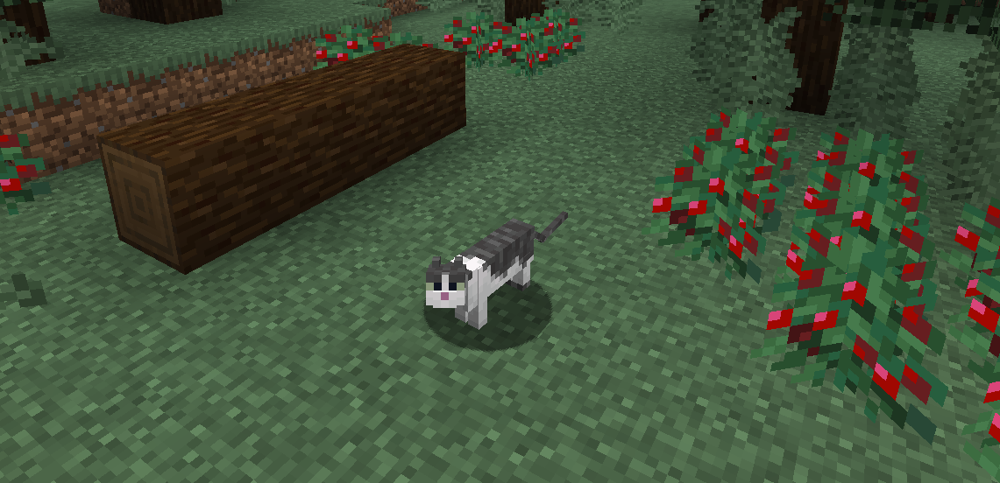
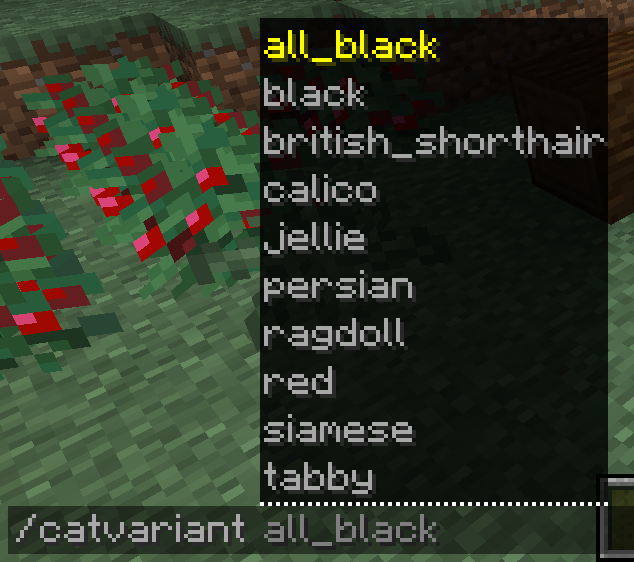
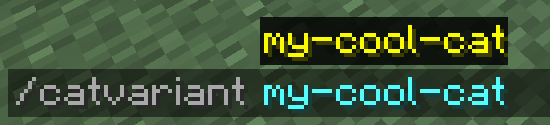
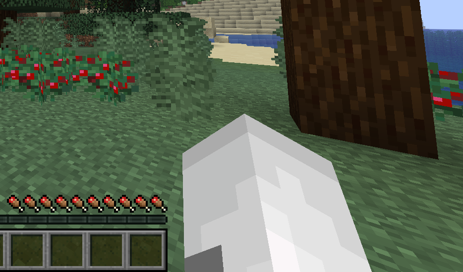
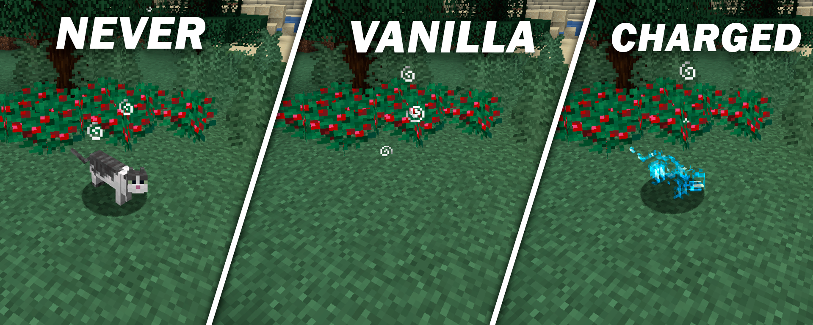
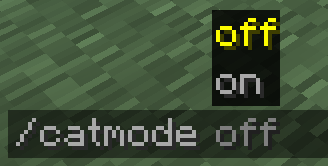
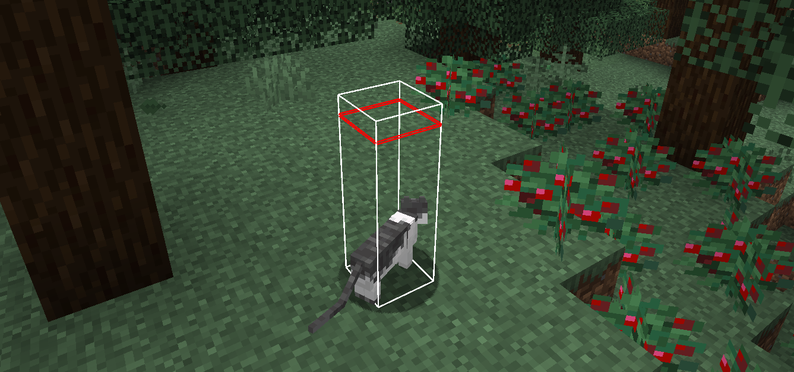

## Catify Mod

This is a **purely client-side** mod that turns your player model **into a cat**!  

It **only changes your model visually** and doesn't affect any interactions or physics.  

## Cat Variant
You can choose any cat skin. That's 11 vanila skins + any amount of custom skins.  
  
Just run **`/catvariant <name>`** to change the cat skin!  

### Custom Skins Supported!

To add an own skin, go to your minecraft folder, then `data/catify/cat_enitity_skins`, put a texture there and it will now automatically appear in the list!  

You can find example textutes in an example folder nearby.  

## Cat Hand
You can make it so your hand in 1st person has a **cat hand skin**!  
This is togglable with **`/cathand <optional on/of>`**  

Custom skins can have a custom cat hand too!

For that, place the required player skin texture in 
`data/catify/cat_hand_skins` and name it **the exact same name** as the custom cat skin earlier (custom cat hand requires a custom cat skin, but you can take both from the example folder nearby.  

## Invisibility Behavior
Because **YOU CAN'T see ARMOR on the cat**, it can be disorienting in 3rd person, when your player is invisible.  

You have 3 options to chose from what you want it to behave like:  
**`/catinvisibility <never/vanilla/charged>`**:
  

- `Never` - your cat model will never go invisible  
- `Vanilla` - your cat gets invisible if the player does so  
- `Charged` - you see an effect similar to charged creeper's glow instead of the cat to indicate where it is technically invisible  

## Cat Mode Switch
You can always fully disable the mod's functionality with one single command:  
- **`/catmode <optional on/of>`**, so you can quickly fully disable the cat mode if needed.

This will toggle the cat hand too, so it's a completely global switch.  

## Usage on Servers
This mod is **completely fine** for using on a server.  

This mod does **NOTHING that can change the physics or interactions**: you're still always 2 blocks tall and your eye position is normal.

The cat technically doesn't exist in the world, it is only manually stored in memory and is just rendered instead of the player.  

There should be no chance a server anticheat can notice a difference, so it's completely fine to use. **It's purely cosmetic**.  

## Notes
- All settings that you change with commands are saved between sessions, including cat skin, cat hand, cat mode.  

## Versions
Fabric:  
- 1.21.2 - 1.21.10  
- This repository branch is for versions 1.21.11+  

Version Differences:
1. Versions from range 1.21.2 - 1.21.4 are way less tested than usual  
2. "Charge" invisibility mode doesn't show up in the inventory in >=1.21.6, only in 3rd person.  
Reason: couldn't force a "translucent" effect show up in gui. If someone knows a solution, I would be glad to accept it.  

## Building the project

The project was built with `JDK 23` and language level `21` in Intellij IDEA.  
More specifically, GraalVM JDK, but that shouldn't be required. I generally recommend Temurin JDK.  
